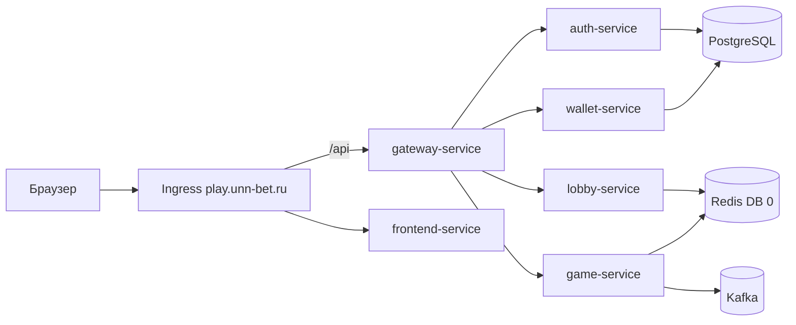

# unn_bet_backend

Микросервисный бэкенд покерной платформы UnnBet (Spring Boot 3, Java 17, Maven).

Репозиторий: [gitlab.com/unn-bet/unn_bet_backend](https://gitlab.com/unn-bet/unn_bet_backend)

---

## Сервисы

| Сервис | Порт | Назначение |
|--------|------|------------|
| `gateway-service` | 8080 | Единая точка входа API, JWT, маршрутизация |
| `auth-service` | 8081 | Регистрация, логин, JWT, RSA-шифрование пароля |
| `wallet-service` | 8082 | Баланс, транзакции |
| `game-service` | 8083 | Игровая логика, SSE-стрим состояния стола |
| `lobby-service` | 8084 | Лобби, комнаты, посадка за стол |
| `game-common` | — | Общие модели, клиенты, фильтры (библиотека) |

Публичный трафик идёт только через **gateway**. Внутри кластера сервисы общаются по DNS Kubernetes (`auth-service`, `lobby-service`, …).

---

## Инфраструктура

### Окружения

| | Production | Integration test |
|---|------------|------------------|
| **URL** | https://play.unn-bet.ru | https://test.unn-bet.ru |
| **K8s namespace** | `default` | `integration-test` |
| **PostgreSQL** | `unn_bet_db` | `unn_bet_test` |
| **Redis (лobby)** | DB `0` | DB `1` |
| **Docker registry** | `cr.yandex/crp7u5ca8scqv2912llu` | те же образы, другой tag при деплое |

Managed-сервисы Yandex Cloud (общие для обоих контуров, разные БД/Redis DB):

- **PostgreSQL** — пользователи, кошельки (Liquibase)
- **Redis** — состояние комнат и лobbies
- **Kafka** — события wallet/game

Конфигурация prod в `k8s/configmap.yaml` и секретах кластера (`unn-bet-secrets`). Секреты **не** коммитятся в git — в репозитории только шаблон `k8s/secret.yaml`.

### Схема prod



### Логи

Логи контейнеров собирает **Fluent Bit** (namespace `logging`) и отправляет в **Yandex Cloud Logging**.

Фильтры в консоли:

```
stream_name = "auth-service"
stream_name = "lobby-service" AND message CONTAINS "LOBBY"
```

Поля `trace.id` / `span.id` сейчас пустые — распределённая трассировка в коде не включена.

### Особенности инфраструктуры (важно для бэкенда)

1. **`auth-service` — 1 реplica** в prod (`k8s/auth-service.yaml`, strategy `Recreate`).  
   RSA-ключи для шифрования пароля генерируются in-memory при старте pod. При нескольких репликах логин с первого раза ломается. **Исправление в коде:** хранить ключи в Secret/volume.

2. **Liquibase changeset ID** должны быть уникальными между сервисами в одной БД (auth и wallet делят `unn_bet_db` / `unn_bet_test`).

3. **Readiness probes** на Java-сервисах — pod получает трафик только после `/actuator/health`.

4. **CronJob `redis-lobby-index-repair`** — чистит битый вторичный индекс Redis `GameRoom` (workaround, пока удаление комнат не чинит индекс в коде).

---

## Локальная разработка

### Требования

- JDK 17
- Maven 3.9+
- Docker (для инфраструктуры)

### Запуск инфраструктуры

```bash
docker compose up -d postgres redis zookeeper kafka
```

Поднимает PostgreSQL, Redis, Kafka локально (см. `docker-compose.yml`).

### Сборка и тесты

```bash
mvn clean compile          # как в CI: compile-java
mvn clean test -Djacoco.skip=true   # unit-tests
mvn clean test             # coverage (JaCoCo, порог 75%)
```

### Секреты локально (`.env`)

```bash
cp .env.example .env
# отредактируйте JWT_SECRET (openssl rand -base64 32)
```

`auth-service` и `gateway-service` читают `JWT_SECRET` из переменной окружения или из `.env` в корне репозитория (Spring `optional:file:../.env[.properties]`). Значение должно совпадать в обоих сервисах. `docker compose` подставляет переменные из `.env` автоматически.

### Запуск отдельного сервиса из IDE

Запускайте нужный `*Application.java` с профилем по умолчанию. Переменные окружения для локали — как в `application.yml` каждого сервиса (`DB_HOST`, `REDIS_HOST`, `JWT_SECRET`, …).

Полный стек локально: все сервисы + gateway + docker compose (см. `docker-compose.yml`, сервисы `auth-service`, `wallet-service`, …).

---

## Kubernetes (`k8s/`)

Манифесты деплоя prod. CI подставляет `$YC_REGISTRY_ID` и `$CI_COMMIT_SHA` вместо `<REGISTRY_ID>` и `:latest`.

| Файл | Содержимое |
|------|------------|
| `auth-service.yaml` … `lobby-service.yaml` | Deployments + Services |
| `gateway-service.yaml` | API gateway |
| `configmap.yaml` | Хосты PG/Redis/Kafka, internal token |
| `secret.yaml` | Шаблон (не применяется CI автоматически) |
| `redis-lobby-maintenance.yaml` | CronJob починки Redis-индекса |

**Изменения только в коде** — правите Java/resources и пушите в `main`.  
**Изменения ресурсов, probes, env** — правите `k8s/` и пушите в `main` (применит `deploy-prod`).

---

## CI/CD (GitLab)

Пайплайн в `.gitlab-ci.yml`. Запускается на ветке **`main`** (и docker-push на тегах `v*`).

### Стадии

```
build → test → docker-push → deploy-prod → integration-test
```

| Job | Стадия | Блокирует релиз? | Описание |
|-----|--------|------------------|----------|
| `compile-java` | build | да | `mvn clean compile` |
| `unit-tests` | test | да | Unit-тесты без JaCoCo |
| `coverage` | test | нет (`allow_failure`) | JaCoCo, порог 75% |
| `build-and-push-docker` | docker-push | да | 5 образов → Container Registry |
| `deploy-prod` | deploy-prod | да | `kubectl apply` в namespace `default` |
| `deploy-integration-test` | integration-test | да | Обновляет образы backend в `integration-test` |
| `trigger-integration-tests` | integration-test | да | Триггерит пайплайн `unn_bet_integration_test` |

### Что происходит при push в `main`

1. Собираются и пушатся Docker-образы с тегом **`$CI_COMMIT_SHA`**.
2. Prod в `default` обновляется на этот tag.
3. Тот же tag выкатывается в **`integration-test`** (только backend-сервисы).
4. Через **Pipeline Trigger Token** стартует репозиторий интеграционных тестов → Playwright на https://test.unn-bet.ru → cleanup.

### Как работать с пайплайном

- **Feature branch** — CI не запускается (rules: только `main`). Локально: `mvn test`.
- **Merge в `main`** — полный цикл до интеграционных тестов. Если упали integration tests — смотрите пайплайн [unn_bet_integration_test](https://gitlab.com/unn-bet/unn_bet_integration_test/-/pipelines).
- **Перезапуск job** — GitLab → Pipeline → Retry job. После фикса инфраструктуры можно retry только `trigger-integration-tests`.
- **Откат prod** — redeploy предыдущего commit SHA через `kubectl set image` или revert + push в `main`.

### Секреты CI (настраивает DevOps)

- `INTEGRATION_TEST_TRIGGER_TOKEN` — trigger token репозитория интеграционных тестов
- OIDC → Yandex Cloud (federation) для registry и kubectl

---

## Чеклист перед merge в `main`

- [ ] `mvn clean test` локально
- [ ] Новые Liquibase changeset с **уникальным id** (не `1` в разных сервисах)
- [ ] Нет hardcoded prod-секретов в коде
- [ ] Если меняли API gateway — согласовать с фронтом
- [ ] Если меняли контракт lobby/game — проверить интеграционные тесты

---

## Связанные репозитории

| Репозиторий | Роль |
|-------------|------|
| [unn_bet_frontend](https://gitlab.com/unn-bet/unn_bet_frontend) | UI, деплой `poker-ui` |
| [unn_bet_integration_test](https://gitlab.com/unn-bet/unn_bet_integration_test) | Playwright E2E |
| `integration-test-env/` (локально у команды) | Манифесты test-контура |

---

## Полезные команды (kubectl)

Доступ к кластеру — через kubeconfig от DevOps.

```bash
kubectl get pods -n default -l app=lobby-service
kubectl logs -n default -l app=auth-service --tail=100
kubectl rollout status deployment/gateway-service -n default
```

Prod API: `https://play.unn-bet.ru/api/...`  
Test API: `https://test.unn-bet.ru/api/...`
